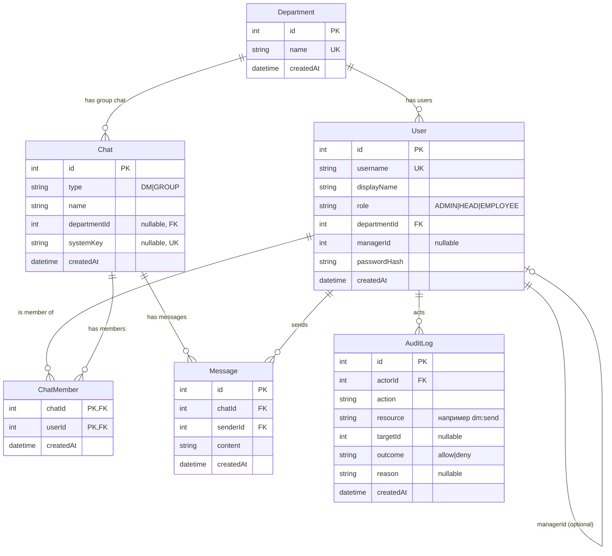
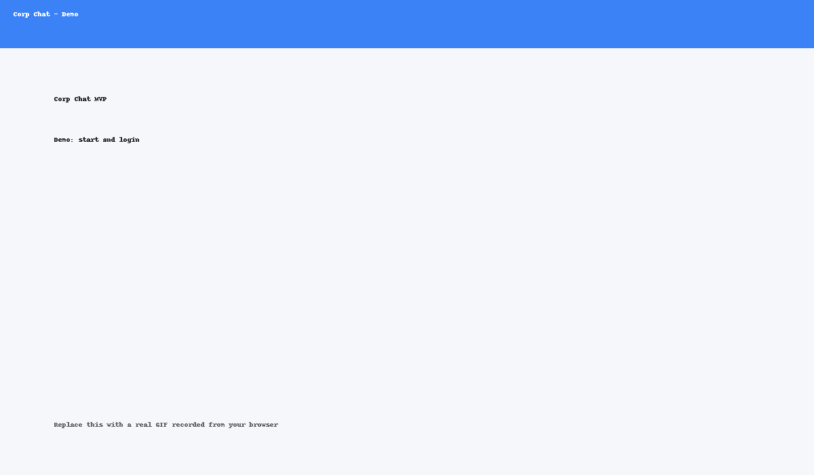

## ER диаграмма

## Демо

Короткий GIF с основными сценариями: логин, отправка сообщения, попытка запрещенного ЛС.

### Как записать свой GIF поверх заглушки
1. Подними приложение локально.
2. Открой браузер, зайди в `/login` под `admin1/admin123`.
3. Используй любой экранный рекордер GIF. Рекомендации: ScreenToGif (Windows), Kap (macOS), Peek (Linux).
4. Сохрани в `docs/demo.gif` и закоммить изменения.