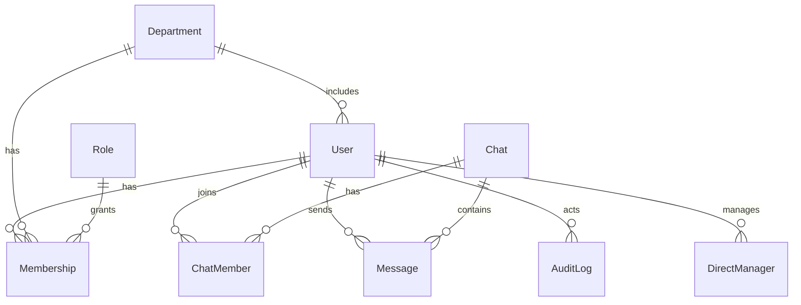

# corp-chat-mvp

MVP корпоративного чата с жесткой иерархией ЛС и групп. Стек - NestJS + Prisma + SQLite/Postgres, JWT, SSE.

## Запуск локально - SQLite
```
cp .env.example .env
npm i
npx prisma migrate dev --schema=prisma/schema.prisma
npx ts-node prisma/seed.ts
npm run dev
# UI: http://localhost:3000/login
```

## Запуск в Docker - Postgres
```
docker compose up -d --build
# UI: http://localhost:3000/login
```

Данные для входа:
- admin1 / admin1
- admin2 / admin2
- head_sales / head_sales
- head_ops / head_ops
- head_it / head_it
- emp_sales_1..3 / emp_sales_1..3
- emp_ops_1..3 / emp_ops_1..3
- emp_it_1..3 / emp_it_1..3

## ER-диаграмма


## Матрица ЛС
| Отправитель | Получатель | Разрешение |
| - | - | - |
| Админ | Любой | 200 |
| Руководитель | Админ | 200 |
| Руководитель | Руководитель | 200 |
| Руководитель | Сотрудник своего отдела | 200 |
| Руководитель | Сотрудник чужого отдела | 403 |
| Сотрудник | Админ | 200 |
| Сотрудник | Свой руководитель того же отдела | 200 |
| Сотрудник | Руководитель чужого отдела | 403 |
| Сотрудник | Сотрудник | 403 |

Псевдокод проверки прав:
```
if sender.isAdmin return allow;
if sender.isHead and recipient.isAdmin or recipient.isHead return allow;
if sender.isHead and recipient.isEmployee and recipient.departmentId == sender.departmentId return allow;
if sender.isEmployee and recipient.isAdmin return allow;
if sender.isEmployee and recipient.isHead and recipient.departmentId == sender.departmentId and sender.managerId == recipient.id return allow;
else deny
```

## Политики чтения ЛС
- Админ может просматривать ЛС любых двух пользователей - GET /api/admin/dms?a=&b=
- Никто кроме админа не может читать чужие ЛС.

## Аудит
Пишется запись при каждой попытке ЛС: actorId, targetId, resource=DM, outcome=ALLOW/DENY, reason при deny.

## Security чеклист
- Пароли - только bcrypt hash, rounds = 10. Минимальная сложность - длина 8+, не совпадать с username.
- Отключить листинг директорий.
- Ограничить размер content - до 2000 символов, проверка на сервере.
- Rate limit на отправку - например, 10 сообщений за 10 секунд на пользователя.
- JWT - httpOnly cookie, SameSite=lax, secure в проде.
- CORS - разрешен только localhost в dev.

## Ограничения
- Реалтайм через SSE без гарантии повторной доставки.
- Нет шифрования сообщений на уровне приложения.
- Изменение ролей и отделов требует синхронизации членов групп.

## Rate limit
Переменные окружения:
- RATE_LIMIT_COUNT=10
- RATE_LIMIT_WINDOW_MS=10000

Применяется на эндпоинтах отправки сообщений.


## Тесты
Перед запуском тестов примените миграции и сиды:
```
npx prisma migrate dev --schema=prisma/schema.prisma
npx ts-node prisma/seed.ts
```
Запуск unit и e2e:
```
npm test
```


## Продовый запуск через Docker Compose (Postgres)
Требуется Docker + Docker Compose.

1) Подготовь файл окружения (можно взять за основу .env.prod.example):
```
cp .env.prod.example .env
# при необходимости поменяй секреты и креды Postgres
```

2) Собери и подними контейнеры:
```
docker compose -f docker-compose.prod.yml up --build
```
Сервисы:
- backend - http://localhost:3000
- adminer - http://localhost:8080 (сервер db, логин/пароль из POSTGRES_*)

Примечания:
- Prisma автоматически применит миграции и запустит сид `scripts/seed.cjs` при старте backend.
- Схема Prisma для Postgres - `prisma/schema.postgres.prisma`.
- Данные Postgres сохраняются в volume `pgdata`.
